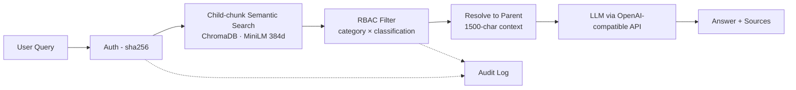

# Enterprise RAG with Role-Based Access Control

🔗 **Live demo:** https://huggingface.co/spaces/dsk44/enterprise-rag-rbac
🎥 **3-minute walkthrough:** _Loom URL — added after recording_

A retrieval-augmented question-answering system that filters documents by user role, document classification, and category — with full audit logging. Same query, different role → different results.

## Demo: same query, different roles

Query: *"What is the incident response procedure?"*

| Login | Role | Results | Notes |
|---|---|---|---|
| `admin / admin123` | Admin | 3 results incl. confidential SOPs | Full access |
| `ciso / secure123` | Security | 3 results, Confidential allowed | Security + engineering scope |
| `john / employee123` | Employee | 2 results, HR/Policies only | Internal max classification |
| `contractor1 / contract123` | Contractor | 0 results, ~15 chunks blocked | Policies-only, Internal max |

## Architecture



- **Parent-Child retrieval** — embed small 300-char children for precision, return 1500-char parents for LLM context
- **RBAC** — `config/rbac_config.json` defines 7 roles, 4 classification levels, and per-category permissions
- **Audit trail** — every query, login, and access denial logged with role + timestamp

## Run locally

```bash
git clone https://github.com/DemigodDSK/enterprise-rag-rbac.git
cd enterprise-rag-rbac
python3.11 -m venv .venv && source .venv/bin/activate
pip install -r requirements.txt
cp .env.example .env   # add your OPENAI_API_KEY
python app.py          # opens http://localhost:7860
```

## Configure RBAC

Edit `config/rbac_config.json` to add roles, users, or change category access. No code changes needed — re-run the app.

## Stack

- Python 3.11, Gradio 4
- LangChain (text splitters, document model)
- ChromaDB + sentence-transformers (`all-MiniLM-L6-v2`, 384d)
- Pluggable LLM via OpenAI-compatible API (configurable via `LLM_PROVIDER` env var — supports OpenAI and Z.AI GLM-4)

## Project status

Built on **synthetic Aurelius Health Systems** policy data — a fictional company. No real client data is used. The RBAC, retrieval, and audit logic are production-grade; the policy text is illustrative.

---

MIT License · © 2026 Datta Sai Krishna Naidu
